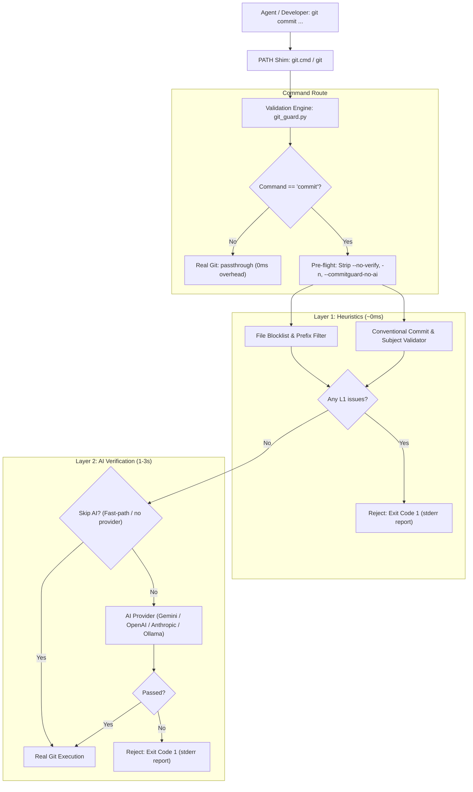

# Architecture Specification

## 1. System Overview

commitguard is an automated git commit interceptor and validator designed for environments where automated AI coding agents and human developers operate concurrently.

The system prevents unwanted artifacts, non-compliant commit messages, debug code, and agent coordination mechanisms from entering git version history.



---

## 2. Core Components

### 2.1 PATH Shim Layer
The shim layer resides in a directory prepended to the system `PATH`. When any process (terminal, IDE, sub-shell, or background agent) invokes `git`, the operating system resolves commitguard's shim instead of the real git executable:
- **Windows (`git.cmd`)**: Batch script delegating all parameters (`%*`) to `python %~dp0git_guard.py`.
- **Unix / macOS (`git`)**: POSIX shell script replacing itself via `exec python3 "$SCRIPT_DIR/git_guard.py" "$@"`.

### 2.2 Discovery of Real Git
`git_guard.py` resolves the absolute path of the true git binary during import:
1. Respects `COMMITGUARD_REAL_GIT` environment variable if set.
2. Scans each directory listed in the system `PATH` environment variable, explicitly ignoring its own directory, until finding the first matching binary (`git.exe` on Windows, `git` on Unix).
3. If no external git executable is found, terminates with exit code 2 and a fatal error message.

### 2.3 Layer 1: Heuristic Validation Pipeline
Layer 1 performs synchronous, zero-network checks in under 5 milliseconds.

#### Staged Files Verification
1. Evaluates staged file paths retrieved via `git diff --cached --name-only --diff-filter=ACMR`.
2. Deleted files (`D` filter) are exempt from checking to ensure removal of previously committed bad files is always permitted.
3. Pipeline stages:
   - **Allowed Prefix Whitelist**: Files matching `allowed_path_prefixes` bypass all blocklist rules.
   - **Exact Filename Blocklist**: Case-insensitive comparison against forbidden agent files (e.g. `AGENTS.md`, `GEMINI.md`, `CLAUDE.md`, `TASKS.md`).
   - **Pattern Matching**: Regex matching against temporary/debug file signatures (e.g. `.tmp`, `.bak`, `debug_*`, `scratch_*`).
   - **Path Prefix Blocklist**: Directory matching against forbidden folders (e.g. `.gemini/`, `.aider/`, `scratch/`).

#### Commit Message Format Verification
1. Subject line parsing (first non-empty line).
2. Emoji check: Rejects any character within Unicode emoji blocks, pictographs, or variation selectors.
3. Structure check: Validates against `^<type>(<scope>): <subject>$`.
4. Type check: Enforces membership in allowed types (`feat`, `fix`, `docs`, `style`, `refactor`, `perf`, `test`, `chore`).
5. Subject length check: Enforces bounds (3 to 100 characters).
6. Anti-vague and anti-task filter: Rejects task number patterns (e.g. `do task 11`, `task #3`, `step 2`) and generic placeholders (`wip`, `updates`, `fixes`).

### 2.4 Layer 2: Semantic AI Analysis Pipeline
Layer 2 executes when Layer 1 passes and AI analysis is enabled:
1. **Fast-path Bypass**: Automatically skips AI evaluation if the commit does not alter documentation files (`.md`, `.rst`, `.txt`) and the total unified diff is under 50 lines.
2. **Token Management**: Large diffs are safely truncated to a configurable budget (default: 8,000 tokens) with a marker (`[DIFF CLIPPED - token limit reached]`).
3. **Multi-Rule Evaluation**: The AI evaluates the prompt against 5 distinct rules and returns a strict JSON payload.
4. **Fail-Open Policy**: If network failure, API outage, rate limiting, or parsing errors occur, Layer 2 logs a warning and permits the commit to proceed.

---

## 3. Provider Abstraction Layer

The system decouples validation logic from individual LLM vendors using the `AIProvider` abstract base class (`src/providers/base.py`):

```python
class AIProvider(ABC):
    @abstractmethod
    def analyze(self, prompt: str) -> AIResult:
        """Send prompt to LLM and parse structured AIResult."""
        ...

    @abstractmethod
    def is_available(self) -> bool:
        """Verify whether required credentials and dependencies are available."""
        ...
```

Concrete provider implementations:
- `GeminiProvider`: Backed by `google-genai` SDK using `gemini-3.5-flash-lite`.
- `OpenAIProvider`: Backed by `openai` SDK using `gpt-4o-mini`.
- `AnthropicProvider`: Backed by `anthropic` SDK using `claude-haiku-4-5`.
- `OllamaProvider`: Native HTTP client using local server (`llama3.2`).

---

## 4. Output Subsystem

All commitguard communications are written strictly to `stderr` using `src/output.py`:
- Standard output (`stdout`) is reserved exclusively for real git output during passthrough.
- Encoding compatibility: Inspects stream capability and automatically substitutes unicode markers (`[X]`, `[OK]`, `[!]`, `->`) when running under non-UTF-8 console code pages (such as Windows `cp1251`).
